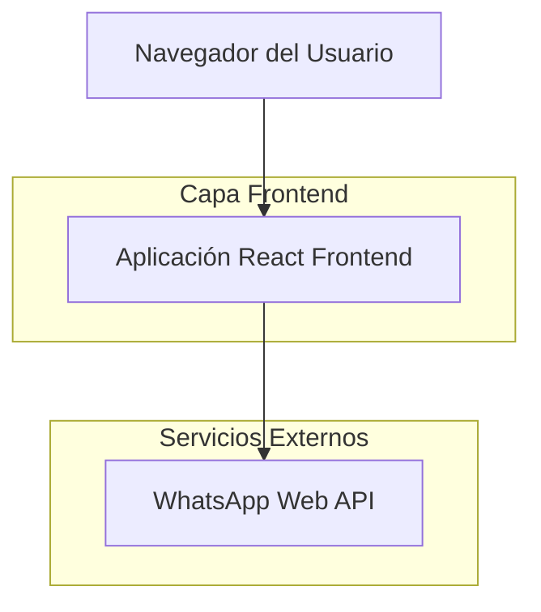
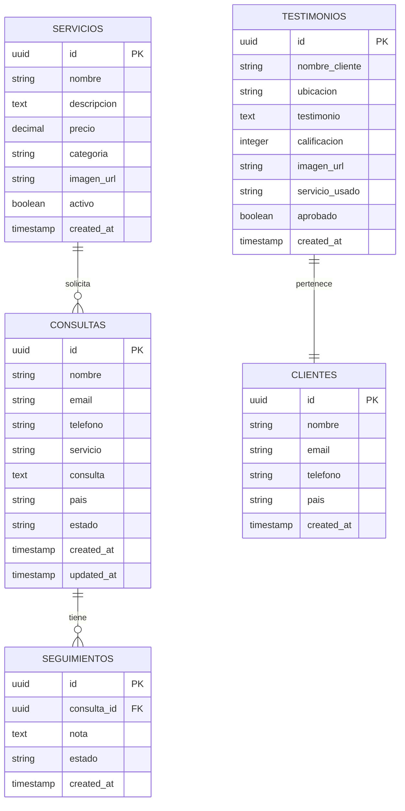

# Documento de Arquitectura Técnica - Landing Page Esotérica

## 1. Diseño de Arquitectura



## 2. Descripción de Tecnología

- Frontend: React@18 + TailwindCSS@3 + Vite + TypeScript
- Tipografía: FK Grotesk (misma fuente que Perplexity.ai)
- Animaciones: Framer Motion para efectos visuales
- SEO: React Helmet para meta tags dinámicos
- Integración: WhatsApp Web API para contacto directo

## 3. Definiciones de Rutas

| Ruta | Propósito |
|------|----------|
| / | Página principal única con todas las secciones (hero, servicios, testimonios, contacto) |
| /#servicios | Ancla a la sección de servicios |
| /#testimonios | Ancla a la sección de testimonios |
| /#contacto | Ancla a la sección de formulario de contacto |

## 4. Integración WhatsApp

### 4.1 Formulario de Contacto

El formulario de contacto redirige directamente a WhatsApp Web con mensaje pre-formateado:

**Campos del formulario:**
| Campo | Tipo | Requerido | Descripción |
|-------|------|-----------|-------------|
| nombre | string | true | Nombre del cliente |
| mensaje | string | true | Mensaje o consulta |

**URL de WhatsApp generada:**
```
https://wa.me/[NUMERO_TELEFONO]?text=Hola,%20soy%20[NOMBRE]%20y%20me%20interesa:%20[MENSAJE]
```

**Ejemplo de implementación:**
```javascript
const enviarWhatsApp = (nombre, mensaje) => {
  const numeroTelefono = "50212345678"; // Número del negocio
  const textoMensaje = `Hola, soy ${nombre} y me interesa: ${mensaje}`;
  const url = `https://wa.me/${numeroTelefono}?text=${encodeURIComponent(textoMensaje)}`;
  window.open(url, '_blank');
};
```

## 5. Configuración de Tipografía

### 5.1 FK Grotesk Font Family

Se utilizará FK Grotesk, la misma fuente que usa Perplexity.ai:

```css
/* Importar FK Grotesk desde Google Fonts o CDN */
@import url('https://fonts.googleapis.com/css2?family=Inter:wght@300;400;500;600;700&display=swap');

/* Fallback a Inter si FK Grotesk no está disponible */
:root {
  --font-primary: 'FK Grotesk', 'Inter', -apple-system, BlinkMacSystemFont, 'Segoe UI', sans-serif;
  --font-display: 'FK Display', 'Inter', sans-serif;
}

body {
  font-family: var(--font-primary);
  font-weight: 400;
  line-height: 1.6;
}

h1, h2, h3 {
  font-family: var(--font-display);
  font-weight: 600;
}
```

### 5.2 Optimización de Rendimiento

**Estrategias para carga rápida:**
- Lazy loading de imágenes
- Compresión de assets con Vite
- Minificación de CSS y JavaScript
- Preload de fuentes críticas
- Optimización de imágenes en formato WebP
- Code splitting por componentes

**Configuración Vite:**
```javascript
// vite.config.js
export default {
  build: {
    rollupOptions: {
      output: {
        manualChunks: {
          vendor: ['react', 'react-dom'],
          animations: ['framer-motion']
        }
      }
    }
  }
};
```

## 6. Modelo de Datos

### 5.1 Definición del Modelo de Datos



### 5.2 Lenguaje de Definición de Datos

Tabla de Consultas (consultas)
```sql
-- crear tabla
CREATE TABLE consultas (
    id UUID PRIMARY KEY DEFAULT gen_random_uuid(),
    nombre VARCHAR(100) NOT NULL,
    email VARCHAR(255) NOT NULL,
    telefono VARCHAR(20) NOT NULL,
    servicio VARCHAR(100) NOT NULL,
    consulta TEXT NOT NULL,
    pais VARCHAR(50),
    estado VARCHAR(20) DEFAULT 'pendiente' CHECK (estado IN ('pendiente', 'en_proceso', 'completada', 'cancelada')),
    created_at TIMESTAMP WITH TIME ZONE DEFAULT NOW(),
    updated_at TIMESTAMP WITH TIME ZONE DEFAULT NOW()
);

-- crear tabla servicios
CREATE TABLE servicios (
    id UUID PRIMARY KEY DEFAULT gen_random_uuid(),
    nombre VARCHAR(100) NOT NULL,
    descripcion TEXT NOT NULL,
    precio DECIMAL(10,2),
    categoria VARCHAR(50) NOT NULL,
    imagen_url VARCHAR(500),
    activo BOOLEAN DEFAULT true,
    created_at TIMESTAMP WITH TIME ZONE DEFAULT NOW()
);

-- crear tabla testimonios
CREATE TABLE testimonios (
    id UUID PRIMARY KEY DEFAULT gen_random_uuid(),
    nombre_cliente VARCHAR(100) NOT NULL,
    ubicacion VARCHAR(100),
    testimonio TEXT NOT NULL,
    calificacion INTEGER CHECK (calificacion >= 1 AND calificacion <= 5),
    imagen_url VARCHAR(500),
    servicio_usado VARCHAR(100),
    aprobado BOOLEAN DEFAULT false,
    created_at TIMESTAMP WITH TIME ZONE DEFAULT NOW()
);

-- crear índices
CREATE INDEX idx_consultas_email ON consultas(email);
CREATE INDEX idx_consultas_estado ON consultas(estado);
CREATE INDEX idx_consultas_created_at ON consultas(created_at DESC);
CREATE INDEX idx_servicios_categoria ON servicios(categoria);
CREATE INDEX idx_testimonios_aprobado ON testimonios(aprobado);

-- permisos para Supabase
GRANT SELECT ON servicios TO anon;
GRANT SELECT ON testimonios TO anon;
GRANT INSERT ON consultas TO anon;
GRANT ALL PRIVILEGES ON consultas TO authenticated;
GRANT ALL PRIVILEGES ON servicios TO authenticated;
GRANT ALL PRIVILEGES ON testimonios TO authenticated;

-- datos iniciales de servicios
INSERT INTO servicios (nombre, descripcion, precio, categoria, activo) VALUES
('Amarres de Amor', 'Rituales especializados para atraer y mantener el amor verdadero', 150.00, 'amor', true),
('Limpias Espirituales', 'Eliminación de energías negativas y bloqueos espirituales', 80.00, 'limpieza', true),
('Lectura de Cartas del Tarot', 'Consulta completa sobre tu futuro amoroso y personal', 50.00, 'adivinacion', true),
('Reconquista de Pareja', 'Rituales especializados para recuperar a tu ser amado', 200.00, 'amor', true),
('Consulta con Brujo Mayor', 'Sesión personalizada con nuestro especialista principal', 300.00, 'consulta', true),
('Hechizos de Protección', 'Rituales para protegerte de enemigos y malas energías', 120.00, 'proteccion', true),
('Magia para Enamorar', 'Rituales para despertar el amor en la persona deseada', 180.00, 'amor', true),
('Curación Espiritual', 'Sanación energética para cuerpo, mente y espíritu', 100.00, 'sanacion', true),
('Consulta Amorosa Gratuita', 'Primera consulta sin costo para evaluar tu situación', 0.00, 'consulta', true),
('Rituales de Abundancia', 'Atraer prosperidad y éxito en todos los aspectos', 160.00, 'abundancia', true);

-- datos iniciales de testimonios
INSERT INTO testimonios (nombre_cliente, ubicacion, testimonio, calificacion, servicio_usado, aprobado) VALUES
('María Elena Rodríguez', 'Guatemala City, Guatemala', 'Después de 3 meses separada de mi esposo, el Brujo Mayor me ayudó con un amarre de amor. En solo 2 semanas él regresó pidiendo perdón. ¡Increíble!', 5, 'Amarres de Amor', true),
('Carlos Mendoza', 'Veracruz, México', 'Las limpias espirituales cambiaron mi vida completamente. Tenía muy mala suerte en todo y ahora todo fluye perfectamente. Muy recomendado.', 5, 'Limpias Espirituales', true),
('Ana Sofía López', 'San Salvador, El Salvador', 'La lectura de cartas fue exacta. Todo lo que me dijeron se cumplió al pie de la letra. Ahora consulto regularmente.', 5, 'Lectura de Cartas del Tarot', true),
('Roberto Castillo', 'Tegucigalpa, Honduras', 'Pensé que había perdido a mi novia para siempre, pero con los rituales de reconquista logré recuperarla. Estamos más unidos que nunca.', 5, 'Reconquista de Pareja', true),
('Lucía Morales', 'Managua, Nicaragua', 'Los hechizos de protección me salvaron de personas que me querían hacer daño. Siento una paz y seguridad increíbles.', 5, 'Hechizos de Protección', true);
```