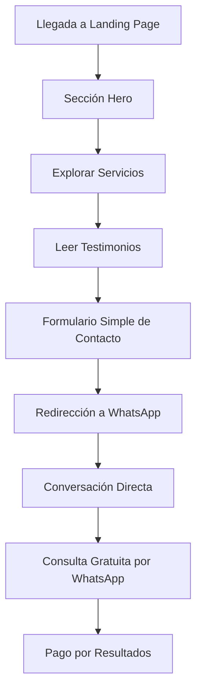

# Documento de Requisitos del Producto - Landing Page Esotérica

## 1. Visión General del Producto

Landing page especializada en servicios espirituales y esotéricos con tema oscuro, diseñada para atraer altas conversiones en el mercado hispanohablante. La página se enfoca en servicios como amarres de amor, brujería, consultas espirituales, curanderos y brujos especializados de Guatemala y Catemaco.

El producto resuelve la necesidad de personas que buscan ayuda espiritual para temas amorosos, reconquista de parejas, limpias energéticas y consultas esotéricas, ofreciendo consultas gratuitas iniciales y pago únicamente cuando se obtengan resultados.

## 2. Características Principales

### 2.1 Roles de Usuario

| Rol | Método de Registro | Permisos Principales |
|-----|-------------------|---------------------|
| Visitante | No requiere registro | Puede navegar, leer contenido, solicitar consulta gratuita |
| Cliente Potencial | Formulario de contacto | Puede solicitar consultas, recibir información personalizada |

### 2.2 Módulo de Características

Nuestra landing page esotérica consta de las siguientes secciones principales:

1. **Página Principal**: sección hero con llamada a la acción, navegación, presentación de servicios principales, testimonios, galería de servicios, formulario de contacto, información de contacto y footer.

### 2.3 Detalles de Página

| Nombre de Página | Nombre del Módulo | Descripción de Características |
|------------------|-------------------|-------------------------------|
| Página Principal | Sección Hero | Presenta título impactante con palabras clave principales, subtítulo persuasivo, botón CTA principal para consulta gratuita, imagen de fondo optimizada para SEO |
| Página Principal | Navegación | Menú sticky con enlaces a secciones internas, logo del sitio, botón de contacto destacado |
| Página Principal | Servicios Principales | Muestra 10 servicios esotéricos con descripciones optimizadas para SEO, iconografía temática, precios y beneficios |
| Página Principal | Testimonios | Presenta 5 testimonios reales con fotos, nombres, ubicaciones y experiencias detalladas de clientes satisfechos |
| Página Principal | Galería de Servicios | Imágenes optimizadas para palabras clave, descripciones alt text, categorización por tipo de servicio |
| Página Principal | Formulario de Contacto | Formulario simple con nombre y mensaje, integración directa con WhatsApp, validación en tiempo real |
| Página Principal | Información de Contacto | Datos de contacto, horarios de atención, métodos de pago, garantías de servicio |
| Página Principal | Footer | Enlaces legales, redes sociales, mapa del sitio, información adicional de contacto |

## 3. Proceso Principal

**Flujo del Visitante:**
1. El usuario llega a la landing page desde búsquedas orgánicas o publicidad
2. Ve la sección hero con propuesta de valor clara
3. Navega por los servicios disponibles
4. Lee testimonios para generar confianza
4. Completa el formulario simple de contacto (nombre y mensaje)
5. Es redirigido automáticamente a WhatsApp con mensaje pre-formateado
6. Inicia conversación directa con el especialista
7. Recibe consulta inicial gratuita por WhatsApp
8. Si decide continuar, paga únicamente cuando obtiene resultados

## 4. Diseño de Interfaz de Usuario

### 4.1 Estilo de Diseño

- **Colores primarios**: Negro profundo (#0a0a0a), morado místico (#4a1a4a), dorado esotérico (#d4af37)
- **Colores secundarios**: Gris oscuro (#1a1a1a), blanco puro (#ffffff), rojo pasión (#8b0000)
- **Estilo de botones**: Redondeados con gradientes sutiles, efectos hover con brillo dorado
- **Fuente**: FK Grotesk (misma que usa Perplexity.ai) con fallback a Inter, pesos 300-700, tamaños 16px-48px
- **Estilo de layout**: Diseño de tarjetas con bordes sutiles, navegación superior fija, espaciado generoso
- **Iconografía**: Símbolos esotéricos, lunas, estrellas, cristales, cartas del tarot, velas

### 4.2 Resumen de Diseño de Página

| Nombre de Página | Nombre del Módulo | Elementos de UI |
|------------------|-------------------|----------------|
| Página Principal | Sección Hero | Fondo degradado oscuro con partículas doradas animadas, tipografía grande y bold, botón CTA con efecto glow, imagen de brujo/a profesional |
| Página Principal | Servicios | Grid responsivo 2x5, tarjetas con hover effects, iconos temáticos, colores de acento por categoría |
| Página Principal | Testimonios | Carrusel horizontal, fotos circulares, estrellas doradas, texto en cursiva, fondo semi-transparente |
| Página Principal | Formulario | Solo 2 campos (nombre y mensaje), bordes dorados, botón WhatsApp verde destacado, fondo con textura sutil |

### 4.3 Responsividad

Diseño mobile-first con adaptación completa para dispositivos móviles, tablets y desktop. Optimización táctil para formularios y navegación. Imágenes adaptativas con lazy loading para velocidad de carga óptima.